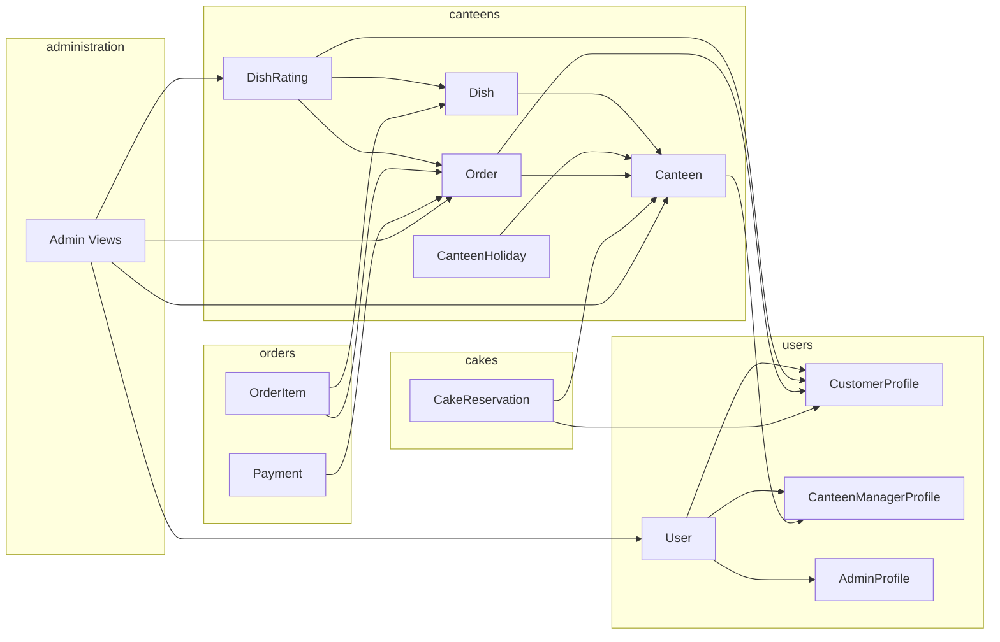

# SkipQ Backend — Context File

> **SkipQ** — campus canteen food ordering platform for IIT Kanpur.  
> Django 5 + Django REST Framework | SQLite (dev) | Session-based auth.

---

## 1. Architecture Overview

```
Backend/
├── config/                    # Django project settings & root URL config
│   ├── settings.py            # Apps, middleware, DRF, CORS, sessions, logging
│   ├── urls.py                # Root URL router → 6 API namespaces
│   ├── authentication.py      # CsrfExemptSessionAuthentication
│   ├── asgi.py / wsgi.py      # ASGI/WSGI entry points
│
├── apps/
│   ├── users/                 # Auth, profiles, wallets
│   ├── canteens/              # Canteen registration, menus, ratings, schedules
│   ├── orders/                # Order lifecycle, payments, cancellation
│   ├── cakes/                 # Cake reservations (advance ordering)
│   └── administration/        # Admin panel (canteen approval, user mgmt, analytics)
│
├── tests/                     # Test suite
├── manage.py
├── requirements.txt           # djangorestframework, django-cors-headers
└── db.sqlite3                 # Dev database
```

### Key Config

| Setting            | Value                                                                           |
| ------------------ | ------------------------------------------------------------------------------- |
| `AUTH_USER_MODEL`  | `users.User`                                                                    |
| Auth class         | `CsrfExemptSessionAuthentication` (session auth, CSRF skipped for API)          |
| Default permission | `IsAuthenticated`                                                               |
| CORS origins       | `localhost:5173`, `127.0.0.1:5173`                                              |
| Session            | DB-backed; extended session = 31 days ("Remember Me"), standard = browser close |
| Time zone          | `Asia/Kolkata`                                                                  |
| Pagination         | `PageNumberPagination`, page size 20                                            |

---

## 2. API Route Map

All endpoints are under their respective `/api/` prefix:

```
api/auth/        → apps.users (auth_urlpatterns)
api/users/       → apps.users (user_urlpatterns)
api/canteens/    → apps.canteens
api/orders/      → apps.orders
api/cakes/       → apps.cakes
api/admin/       → apps.administration
```

---

## 3. Users App

### Purpose
User authentication (registration with OTP, login with Remember Me), profile management, and wallet operations.

### File Structure
```
users/
├── models.py             # User, CustomerProfile, CanteenManagerProfile, AdminProfile,
│                         #   AdminActivityLog, OTPVerification
├── serializers.py        # InitiateSignup, VerifyOTP, Login, User, Profile, Wallet serializers
├── views.py              # 8 views: initiate_signup, verify_otp, login, logout,
│                         #   profile, wallet_balance, add_funds, set_wallet_pin
├── urls.py               # Split into auth_urlpatterns + user_urlpatterns
├── admin.py              # Admin config for all user models
├── management/commands/
│   └── seed_data.py      # Dev data seeder
└── services/
    ├── auth_service.py   # Registration (OTP), login/logout, PIN hashing/verification
    └── profile_service.py # add_funds, deduct_funds, refund_to_wallet, set_wallet_pin,
                          #   credit_to_manager
```

### Data Models

#### `User` (custom `AbstractBaseUser`)
| Field                    | Type                | Notes                             |
| ------------------------ | ------------------- | --------------------------------- |
| `email`                  | EmailField (unique) | `USERNAME_FIELD`                  |
| `role`                   | CharField (choices) | `CUSTOMER` / `MANAGER` / `ADMIN`  |
| `is_suspended`           | BooleanField        | Admin ban flag                    |
| `is_verified`            | BooleanField        | Set `True` after OTP verification |
| `is_active` / `is_staff` | BooleanField        | Django auth compat                |

#### `CustomerProfile` (OneToOne → User)
| Field             | Type                  | Notes                 |
| ----------------- | --------------------- | --------------------- |
| `name`            | CharField             | Customer display name |
| `phone`           | CharField             | Contact number        |
| `wallet_balance`  | DecimalField(10,2)    | Current balance       |
| `wallet_pin_hash` | CharField             | SHA-256 hashed PIN    |
| `favorite_dishes` | M2M → `canteens.Dish` |                       |

#### `CanteenManagerProfile` (OneToOne → User)
| Field             | Type               | Notes              |
| ----------------- | ------------------ | ------------------ |
| `manager_id`      | UUIDField          | Auto-generated     |
| `contact_details` | CharField          |                    |
| `wallet_balance`  | DecimalField(10,2) | Earnings wallet    |
| `wallet_pin_hash` | CharField          | SHA-256 hashed PIN |

#### `AdminProfile` (OneToOne → User)
| Field        | Type      | Notes                |
| ------------ | --------- | -------------------- |
| `admin_id`   | UUIDField | Auto-generated       |
| `role_level` | CharField | Default `"STANDARD"` |

#### `AdminActivityLog` (FK → AdminProfile)
`action`, `details`, `timestamp`

#### `OTPVerification`
Stores email, OTP, hashed password, role, and name during registration. OTP valid for 10 minutes.

### API Endpoints

| Method    | Path                          | View              | Auth   | Description                                |
| --------- | ----------------------------- | ----------------- | ------ | ------------------------------------------ |
| POST      | `api/auth/register/`          | `initiate_signup` | Public | Validate email domain + send OTP           |
| POST      | `api/auth/verify-otp/`        | `verify_otp`      | Public | Verify OTP → create user + profile         |
| POST      | `api/auth/login/`             | `login_view`      | Public | Authenticate → session (standard/extended) |
| POST      | `api/auth/logout/`            | `logout_view`     | Auth   | Destroy session                            |
| GET/PATCH | `api/users/profile/`          | `profile_view`    | Auth   | Get/update profile (role-aware)            |
| GET       | `api/users/wallet/`           | `wallet_balance`  | Auth   | Current wallet balance                     |
| POST      | `api/users/wallet/add-funds/` | `add_funds`       | Auth   | Add funds (customers only)                 |
| POST      | `api/users/wallet/set-pin/`   | `set_wallet_pin`  | Auth   | Set/update wallet PIN                      |

### Service Layer

**`auth_service.py`**: `validate_registration_email()` (IITK domain check for students), `generate_and_send_otp()`, `verify_otp()`, `initiate_signup()`, `complete_registration()`, `authenticate_user()`, `logout_user()`, `hash_wallet_pin()`, `verify_wallet_pin()`

**`profile_service.py`**: `update_customer_profile()`, `add_funds()`, `deduct_funds()`, `refund_to_wallet()`, `set_wallet_pin()`, `credit_to_manager()`

---

## 4. Canteens App

### Purpose
Canteen registration/approval, menu management, dish ratings, holiday scheduling, wait time estimation, and manager dashboard.

### File Structure
```
canteens/
├── models.py             # Canteen, CanteenHoliday, Dish, DishRating
├── serializers.py        # Canteen, Dish, DishRating, Holiday, Registration, Status, Popular serializers
├── views.py              # 11 views: list, detail, register, status, menu, add_dish,
│                         #   manage_dish, toggle, holidays, wait_time, documents,
│                         #   lead_time, manager_dashboard
├── urls.py               # 13 URL patterns
├── admin.py              # Admin config for all canteen models
└── services/
    ├── canteen_service.py # Registration (submit/approve/reject), state transitions, holidays
    └── menu_service.py    # CRUD dishes, ratings, rating recalculation
```

### Data Models

#### `Canteen`
| Field                           | Type                               | Notes                                                                                     |
| ------------------------------- | ---------------------------------- | ----------------------------------------------------------------------------------------- |
| `name`                          | CharField                          |                                                                                           |
| `location`                      | CharField                          |                                                                                           |
| `opening_time` / `closing_time` | TimeField                          | Supports overnight hours                                                                  |
| `lead_time_config`              | IntegerField                       | Min hours for cake reservations (default 6)                                               |
| `status`                        | CharField (choices)                | `UNDER_REVIEW` / `REJECTED` / `ACTIVE` / `OPEN` / `CLOSED` / `BUSY` / `EMERGENCY_CLOSURE` |
| `manager`                       | OneToOne → `CanteenManagerProfile` |                                                                                           |
| `documents`                     | FileField                          | Registration docs for admin review                                                        |
| `rejection_reason`              | TextField                          |                                                                                           |

**Key methods:** `is_open()`, `get_estimated_wait_time()`, `check_availability(date)`

#### Canteen State Machine
```
UNDER_REVIEW → (Admin approves) → ACTIVE
ACTIVE → OPEN / CLOSED
OPEN ↔ BUSY
OPEN / BUSY → EMERGENCY_CLOSURE
EMERGENCY_CLOSURE → OPEN / CLOSED
CLOSED → OPEN
```

#### `CanteenHoliday` (FK → Canteen)
`date`, `description` — unique together (canteen, date)

#### `Dish` (FK → Canteen)
| Field          | Type              | Notes                   |
| -------------- | ----------------- | ----------------------- |
| `name`         | CharField         |                         |
| `price`        | DecimalField(8,2) |                         |
| `description`  | TextField         |                         |
| `is_available` | BooleanField      | Togglable               |
| `discount`     | DecimalField(5,2) | Percentage (0–100)      |
| `photo`        | ImageField        |                         |
| `rating`       | DecimalField(3,2) | Auto-calculated average |
| `category`     | CharField         |                         |

**Key methods:** `toggle_availability()`, `get_effective_price()`

#### `DishRating` (FK → Dish, FK → CustomerProfile, FK → Order)
`rating` (1–5), `created_at` — `unique_together = (dish, customer, order)`

### API Endpoints

| Method       | Path                               | View                       | Auth          | Description                    |
| ------------ | ---------------------------------- | -------------------------- | ------------- | ------------------------------ |
| GET          | `api/canteens/`                    | `canteen_list`             | Public        | List active canteens           |
| GET          | `api/canteens/<id>/`               | `canteen_detail`           | Public        | Canteen details                |
| GET          | `api/canteens/<id>/wait-time/`     | `estimated_wait_time`      | Public        | Est. wait time                 |
| POST         | `api/canteens/register/`           | `register_canteen`         | Manager       | Submit registration            |
| PATCH        | `api/canteens/<id>/status/`        | `update_canteen_status`    | Manager       | State transition               |
| GET          | `api/canteens/<id>/menu/`          | `canteen_menu`             | Public        | List dishes                    |
| GET          | `api/canteens/<id>/menu/popular/`  | `canteen_popular_dishes`   | Public        | Popular dishes for a canteen   |
| POST         | `api/canteens/<id>/menu/add/`      | `add_dish`                 | Manager       | Add dish                       |
| PATCH/DELETE | `api/canteens/dishes/<id>/`        | `manage_dish`              | Manager       | Update/delete dish             |
| POST         | `api/canteens/dishes/<id>/toggle/` | `toggle_dish_availability` | Manager       | Toggle availability            |
| GET          | `api/canteens/dishes/popular/`     | `popular_dishes`           | Public        | Globally ranked popular dishes |
| GET/POST     | `api/canteens/<id>/holidays/`      | `manage_holidays`          | Auth          | List/add holidays              |
| GET          | `api/canteens/<id>/documents/`     | `canteen_documents`        | Manager/Admin | View registration docs         |
| GET          | `api/canteens/<id>/lead-time/`     | `lead_time_config`         | Public        | Lead time config               |
| GET          | `api/canteens/manager/dashboard/`  | `manager_dashboard`        | Manager       | Earnings + queue stats         |

### Service Layer

**`canteen_service.py`**: `submit_canteen_registration()`, `approve_canteen()`, `reject_canteen()`, `update_canteen_operational_status()` (validates state transitions), `add_holiday()`, `remove_holiday()`, `get_holidays()`

**`menu_service.py`**: `get_menu()`, `add_dish()`, `update_dish()`, `update_price()`, `update_discount()`, `add_rating()` (recalculates average rating)

---

## 5. Orders App

### Purpose
Full order lifecycle — placement with wallet payment, manager actions (accept/reject/ready/complete), cancellation flow, and auto-refunds.

### File Structure
```
orders/
├── models.py             # Order, OrderItem, Payment
├── serializers.py        # OrderSerializer, PlaceOrderSerializer, OrderActionSerializer, RateOrderSerializer
├── views.py              # 12 views: place, detail, history, pending, active,
│                         #   accept, reject, ready, complete,
│                         #   request_cancel, approve_cancel, reject_cancel
├── urls.py               # 12 URL patterns
├── admin.py              # OrderAdmin (with OrderItemInline), PaymentAdmin
└── services/
    ├── order_service.py    # place, accept, reject, ready, complete, cancel flow, queries
    └── payment_service.py  # authorize, process, refund, validate-and-deduct
```

### Data Models

#### `Order`
| Field                     | Type                     | Notes                        |
| ------------------------- | ------------------------ | ---------------------------- |
| `customer`                | FK → `CustomerProfile`   |                              |
| `canteen`                 | FK → `Canteen`           |                              |
| `status`                  | CharField (choices)      | See state machine below      |
| `book_time`               | DateTimeField (auto)     |                              |
| `receive_time`            | DateTimeField (nullable) | Set on `COMPLETED`           |
| `notes`                   | TextField                | Customer instructions        |
| `reject_reason`           | TextField                | Manager's rejection reason   |
| `cancel_rejection_reason` | TextField                | Manager's cancel-deny reason |

**Key methods:** `update_order_status()` (enforces state machine), `calculate_total()`, `create_order()`, `query_active_orders()`, `place_order()`, `add_to_order_history()`

#### Order State Machine
```
PENDING ──→ ACCEPTED ──→ READY ──→ COMPLETED
   │            │
   │            └──→ CANCEL_REQUESTED ──→ CANCELLED ──→ REFUNDED
   │                        │
   │                        └──→ PENDING (cancel rejected)
   │
   ├──→ REJECTED ──→ REFUNDED
   │
   └──→ CANCEL_REQUESTED ──→ CANCELLED ──→ REFUNDED
                │
                └──→ PENDING (cancel rejected)

Cake-specific:
PENDING_APPROVAL ──→ CONFIRMED ──→ READY ──→ COMPLETED
        │
        └──→ REJECTED ──→ REFUNDED
```

#### `OrderItem` (FK → Order, FK → Dish)
| Field            | Type                 | Notes                                     |
| ---------------- | -------------------- | ----------------------------------------- |
| `quantity`       | PositiveIntegerField | Default 1                                 |
| `price_at_order` | DecimalField(8,2)    | Snapshot of effective price at order time |

#### `Payment` (OneToOne → Order)
| Field    | Type               | Notes                                |
| -------- | ------------------ | ------------------------------------ |
| `amount` | DecimalField(10,2) |                                      |
| `status` | CharField          | `PENDING` → `COMPLETED` → `REFUNDED` |

### API Endpoints

| Method | Path                              | View                   | Role     | Description                                |
| ------ | --------------------------------- | ---------------------- | -------- | ------------------------------------------ |
| POST   | `api/orders/place/`               | `place_order`          | Customer | PIN verify + deduct + create               |
| GET    | `api/orders/<id>/`                | `order_detail`         | Owner    | Order details                              |
| GET    | `api/orders/history/`             | `order_history`        | Customer | Completed + refunded orders                |
| GET    | `api/orders/pending/`             | `pending_orders`       | Manager  | PENDING + PENDING_APPROVAL                 |
| GET    | `api/orders/active/`              | `active_orders`        | Manager  | PENDING + ACCEPTED + READY                 |
| POST   | `api/orders/<id>/accept/`         | `accept_order`         | Manager  | PENDING → ACCEPTED                         |
| POST   | `api/orders/<id>/reject/`         | `reject_order`         | Manager  | PENDING → REJECTED → REFUNDED              |
| POST   | `api/orders/<id>/ready/`          | `mark_ready`           | Manager  | ACCEPTED → READY                           |
| POST   | `api/orders/<id>/complete/`       | `mark_completed`       | Manager  | READY → COMPLETED (credits manager wallet) |
| POST   | `api/orders/<id>/cancel/`         | `request_cancel_order` | Customer | PENDING/ACCEPTED → CANCEL_REQUESTED        |
| POST   | `api/orders/<id>/approve-cancel/` | `approve_cancel_order` | Manager  | CANCEL_REQUESTED → CANCELLED → REFUNDED    |
| POST   | `api/orders/<id>/reject-cancel/`  | `reject_cancel_order`  | Manager  | CANCEL_REQUESTED → PENDING                 |

### Service Layer

**`order_service.py`**: `place_order()` (`@transaction.atomic` — validates canteen status, checks dish availability, PIN verify + deduct, creates Order + OrderItems + Payment), `accept_order()`, `reject_order()` (auto-refund), `mark_order_ready()`, `mark_order_completed()` (credits manager wallet), `request_cancel()`, `approve_cancel()` (`@transaction.atomic`), `reject_cancel()`, `rate_order()` (per-dish ratings), `get_order_history()`, `get_pending_orders()`, `get_active_orders()`

**`payment_service.py`**: `authorize_payment()` (PIN + balance check), `process_payment()`, `process_refund()` (refund to wallet + update payment status), `validate_and_deduct_funds()` (combined authorize + deduct)

---

## 6. Cakes App

### Purpose
Cake reservation workflow — availability check, submit reservation with advance payment, and manager decision (accept/reject with auto-refund).

### File Structure
```
cakes/
├── models.py             # CakeReservation
├── serializers.py        # CakeReservationSerializer, CheckAvailability, SubmitReservation, 
│                         #   ReservationAction serializers
├── views.py              # 7 views: check_availability, submit_reservation, my_reservations,
│                         #   pending_reservations, accept, reject, complete
├── urls.py               # 7 URL patterns
├── admin.py              # CakeReservationAdmin
└── services/
    └── cake_service.py   # check_availability, submit_reservation, accept, reject, complete
```

### Data Model — `CakeReservation`
| Field              | Type                   | Notes                |
| ------------------ | ---------------------- | -------------------- |
| `customer`         | FK → `CustomerProfile` |                      |
| `canteen`          | FK → `Canteen`         |                      |
| `flavor`           | CharField(100)         |                      |
| `size`             | CharField(50)          | e.g., "0.5kg", "1kg" |
| `design`           | CharField(255)         |                      |
| `message`          | CharField(500)         | Text on cake         |
| `pickup_date`      | DateField              |                      |
| `pickup_time`      | TimeField              |                      |
| `advance_amount`   | DecimalField(10,2)     | Paid upfront         |
| `status`           | CharField              | See state machine    |
| `rejection_reason` | TextField              |                      |

#### Cake Reservation State Machine
```
CONFIGURATION ──→ PENDING_APPROVAL ──→ CONFIRMED ──→ COMPLETED
                        │
                        └──→ REJECTED ──→ REFUNDED
```

### API Endpoints

| Method | Path                            | View                   | Role     | Description                  |
| ------ | ------------------------------- | ---------------------- | -------- | ---------------------------- |
| POST   | `api/cakes/check-availability/` | `check_availability`   | Auth     | Holiday + lead time check    |
| POST   | `api/cakes/reserve/`            | `submit_reservation`   | Customer | PIN verify + deduct + create |
| GET    | `api/cakes/my-reservations/`    | `my_reservations`      | Customer | All customer reservations    |
| GET    | `api/cakes/pending/`            | `pending_reservations` | Manager  | Pending approval list        |
| POST   | `api/cakes/<id>/accept/`        | `accept_reservation`   | Manager  | → CONFIRMED                  |
| POST   | `api/cakes/<id>/reject/`        | `reject_reservation`   | Manager  | → REJECTED → REFUNDED        |
| POST   | `api/cakes/<id>/complete/`      | `complete_reservation` | Manager  | → COMPLETED                  |

### Service Layer

**`cake_service.py`**: `check_availability()` (delegates to `canteen.check_availability()`), `submit_reservation()` (`@transaction.atomic` — PIN verify + deduct + create), `accept_reservation()`, `reject_reservation()` (`@transaction.atomic` — reject + auto-refund), `complete_reservation()`

---

## 7. Administration App

### Purpose
Admin-only operations — canteen registration approval, user management (suspend/unsuspend), global analytics, content moderation, broadcast notifications, and activity logging.

### File Structure
```
administration/
├── views.py              # 8 views: pending_canteen_requests, approve/reject_canteen,
│                         #   list_users, suspend/unsuspend_user, global_analytics,
│                         #   activity_log, broadcast_notification, moderate_content
├── urls.py               # 8 URL patterns
├── admin.py              # (default)
└── models.py             # (empty — uses models from users & canteens apps)
```

### API Endpoints

| Method | Path                                       | View                       | Description                       |
| ------ | ------------------------------------------ | -------------------------- | --------------------------------- |
| GET    | `api/admin/canteen-requests/`              | `pending_canteen_requests` | List UNDER_REVIEW canteens        |
| POST   | `api/admin/canteen-requests/<id>/approve/` | `approve_canteen`          | Approve → ACTIVE                  |
| POST   | `api/admin/canteen-requests/<id>/reject/`  | `reject_canteen`           | Reject with reason                |
| GET    | `api/admin/users/`                         | `list_users`               | All users list                    |
| POST   | `api/admin/users/<id>/suspend/`            | `suspend_user`             | Ban user (can't suspend admins)   |
| POST   | `api/admin/users/<id>/unsuspend/`          | `unsuspend_user`           | Lift ban                          |
| GET    | `api/admin/analytics/`                     | `global_analytics`         | User/canteen/order/revenue stats  |
| GET    | `api/admin/activity-log/`                  | `activity_log`             | Last 50 admin actions             |
| POST   | `api/admin/broadcast/`                     | `broadcast_notification`   | Message to users (by role filter) |
| POST   | `api/admin/moderate/`                      | `moderate_content`         | Delete ratings or canteens        |

All endpoints require admin role. Actions are logged via `AdminActivityLog`.

---

## 8. Cross-App Dependency Map



| From             | Depends On                       | Usage                                                         |
| ---------------- | -------------------------------- | ------------------------------------------------------------- |
| `orders`         | `users.CustomerProfile`          | FK on Order; wallet operations                                |
| `orders`         | `users.services.auth_service`    | `verify_wallet_pin()`                                         |
| `orders`         | `users.services.profile_service` | `deduct_funds()`, `refund_to_wallet()`, `credit_to_manager()` |
| `orders`         | `canteens.Canteen`               | FK on Order; status checking                                  |
| `orders`         | `canteens.Dish`                  | FK on OrderItem; price + availability                         |
| `cakes`          | `users.CustomerProfile`          | FK on CakeReservation; wallet                                 |
| `cakes`          | `users.services`                 | PIN verify + fund deduction/refund                            |
| `cakes`          | `canteens.Canteen`               | FK; availability + holiday check                              |
| `canteens`       | `users.CanteenManagerProfile`    | OneToOne on Canteen                                           |
| `canteens`       | `users.CustomerProfile`          | FK on DishRating                                              |
| `canteens`       | `orders.models`                  | Active order count for wait time                              |
| `administration` | `users`, `canteens`, `orders`    | Reads all app models for admin ops                            |

---

## 9. Key Design Decisions

1. **Session-based auth** with `CsrfExemptSessionAuthentication` — CORS handles origin validation
2. **Wallet PIN** — SHA-256 hashed, verified before every order/reservation
3. **Price snapshot** — `price_at_order` captures effective price at order time
4. **Atomic transactions** — `place_order()`, `approve_cancel()`, `reject_reservation()` use `@transaction.atomic`
5. **Auto-refund** — rejection automatically refunds customer wallet and advances payment to `REFUNDED`
6. **Payment created as COMPLETED** — funds deducted upfront, payment record starts as `COMPLETED`
7. **Manager wallet credit** — `mark_order_completed()` credits order amount to manager's wallet
8. **State machine enforcement** — both `Order.update_order_status()` and `CakeReservation.update_status()` enforce valid transitions via explicit allowed-transition maps
9. **Cancellation workflow** — customer requests → manager approves (refund) or rejects (revert to PENDING) — separate from manager-initiated rejection
10. **IITK email validation** — customer registration restricted to `@iitk.ac.in` domain
11. **OTP-based registration** — credentials stored in OTP record; user created only after verification
12. **Canteen state management** — multi-state system (UNDER_REVIEW → ACTIVE → operational states) with admin approval gate

---

## 10. Django Admin

| App          | Registered Models                                                                             | Key Features                                        |
| ------------ | --------------------------------------------------------------------------------------------- | --------------------------------------------------- |
| **users**    | User, CustomerProfile, CanteenManagerProfile, AdminProfile, AdminActivityLog, OTPVerification | Filters by role/status; search by email             |
| **canteens** | Canteen, Dish, DishRating, CanteenHoliday                                                     | Filter by status/category/canteen                   |
| **orders**   | Order (with OrderItemInline), Payment                                                         | Filter by status/canteen; search by customer email  |
| **cakes**    | CakeReservation                                                                               | Filter by status/canteen; search by customer/flavor |
